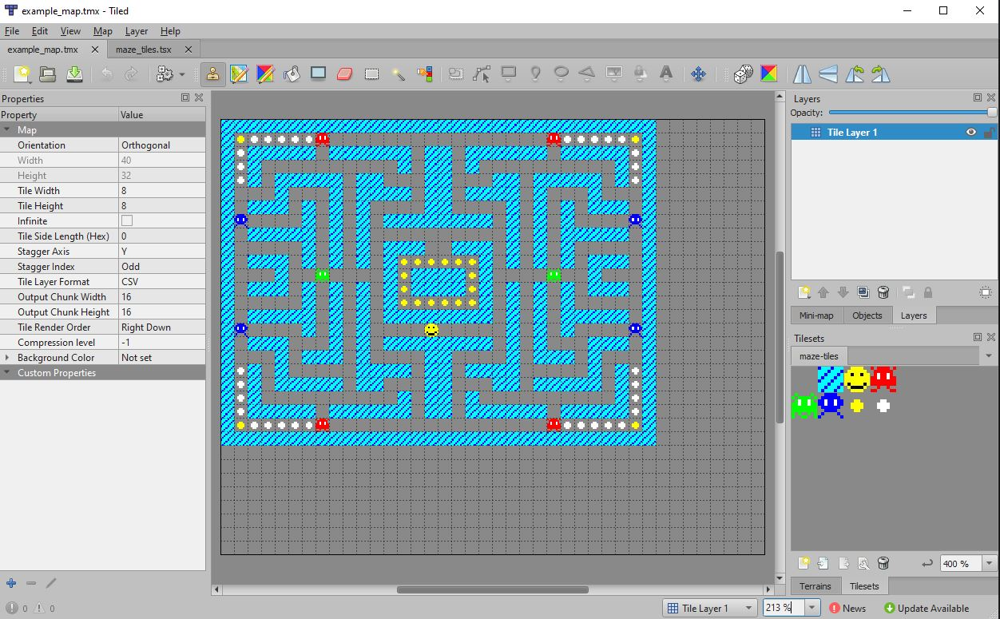
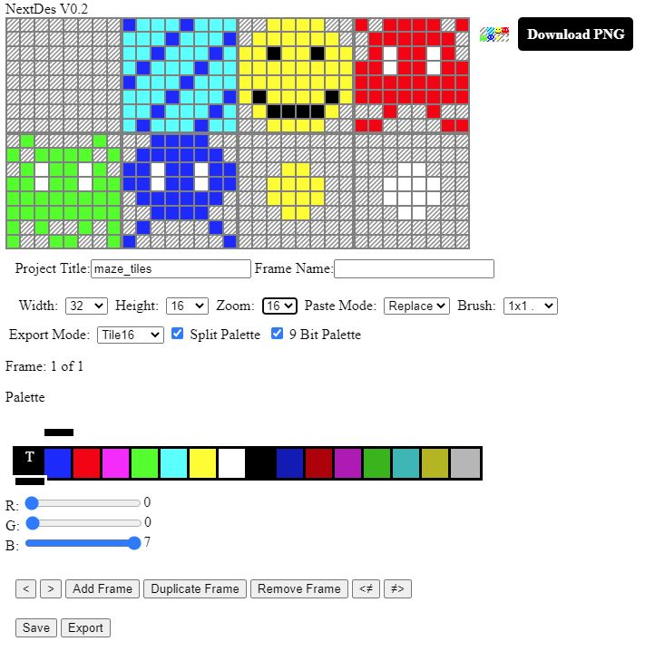
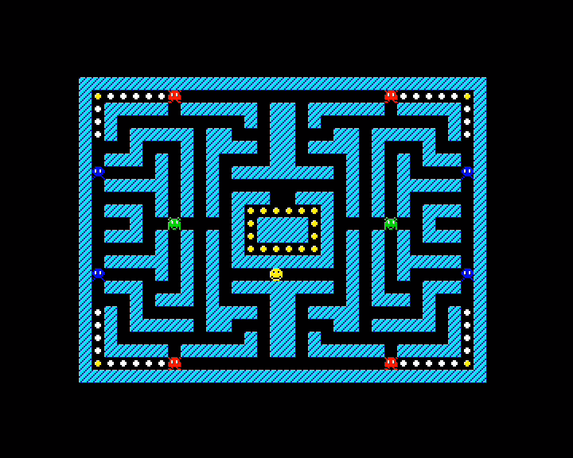

# RLE Compression

## Overview
RLE compression is a simple compression scheme that is quite easy to understand and well suited to 8 bit microprocessors. It can be quite efficient at compressing data with a lot of repetition, good examples would include the tile map data for maze based games, something I used it quite effectively for in Galaxy of Error (see www.stevemonks.com/goe/), which is where this code is adapted from.

This example provides an end to end demonstration of how to take a tile map designed in the free TileEd software (https://www.mapeditor.org/), extract the tile layer, compress it, convert it into a format that can be included into assembler source and then decompress it into a tilemap that the Next can render.

The tiles themselves were created with NextDes (www.stevemonks.com/nextdes/).

## Repository Layout - what's what
The repository is split up into several directories;
* src-assets - this contains files created with TileEd and NextDes, they are;
    * example_map.tmx - this is TileEd tilemap for an imaginary Maze Invaders game. It can be loaded and edited in TileEd.
    * maze_tiles.tsx - this is a TileEd tile set, it can be loaded and edited in TileEd.
    * example_map.json - this is the tilemap exported from TileEd in JSON format. It's exported in this format as this makes it easy to work with from Javascript (see the compressor section below). This is the file we will be converting into something that can be loaded by the Next.
    * maze_tiles.json - this is the saved tile project from NextDes. It can be reloaded into NextDes by dragging and dropping it onto the editor area.
    * maze_tiles.png - this is a bitmap exported from NextDes and used by TileEd to create and display the tile set.
* compressor - this contains the code used to convert example_map.json into an ASM file that can be included in the source fed to the assembler. It's written in Javascript. Although Javascript is often sneered at by "real" programmers, it has several advantages over other languages, namely the only tools you need to create, run and debug Javascript programs are a text editor and a web browser, two pieces of software found on most modern computers. I've worked on more than 30 high profile titles over the years, mostly written in C,C++,C# and assembler and I think Javascript is great for quickly knocking together little utilities like this. Anyway, this folder contains two files;
    * mapconvert.html - a HTML wrapper allowing the Javascript program to be run in a web browser. Double click or drag and drop this file into a browser to open it. Tested in Chrome running on Windows 10.
    * convert.js - a Javascript program that takes the JSON file exported from TileEd and generates an asm file containing the compressed tilemap.
* next - this contains the files required to build the executable that can be run on the next. This is an adapted version of the the SimpleTilemap sample, it's practically the same code with the addition of an RLE decompressor and some different tile pattern and palette definitions. It contains the following files;
    * zeus.asm - asm file used to build the program when assembling with zeus (zcl.exe or zcltest.exe).
    * rle_compression_example.s - adapted version of simple_tilemap.s. This sets up the tilemap hardware, loads the palette and invokes the decompressor which unpacks the compressed tilemap directly into tilemap memory.
    * rle.s - the RLE decompressor.
    * rle_compression_example.snx/.nex - prebuilt executables that will run on a Next or CSpect.
* next\assets - this folder contains all of the assets that get assembled into the executable. I've put them into their own folder to clarify that they are "assets" and not executable code. It contains;
    * example_map.s - the output from the compressor when example_map.json is fed into it.
    * maze_tiles.s - the tile patterns exported from NextDes.
    * maze_tiles_palette.s - the 9 bit tile palette exported from NextDes.

## The Source Data
You should be able to open the source data in TileEd by loading src-assets\example_map.tmx into TileEd. Once open it should look like this;
<!---->

Describing how to use TileEd is beyond the scope of this guide, but it is relatively simple to use and also quite powerful, I've used it in a number of commercial projects including Alien Breed Mobile (Team17), Playtime Island (BBC), Bomb Bunny Boogie (Digital Application Design) as well as Galaxy of Error on the Next.

The tiles were created in NextDes (www.stevemonks.com/nextdes/) and they can be edited on that website by dropping the file src-assets\maze_tiles.json onto the editing area of the NextDes screen. it should look like this; 
<!---->


The "Download PNG" button was used to create the maze_tiles.png file used by TileEd to create and display the tile set. Updated tile pattern and tile palette source can be downloaded by hitting the "Export" button and any changes saved to a new JSON file by hitting the "Save" button.

## Using The Compressor
If you double click on ```mapconvert.html``` it _should_ open in Chrome (on Windows) presenting this super simple UI. I haven't tested this on a Mac yet, will update when I have. What you should see is this;

<!---->


If you drag and drop the file ```example_map.json``` onto where it says "Drop Stuff Here", it should change to this;

<!---->


and attempt to download example_map.s to your computer (you may need to give it permission to do this). In some instances, downloading to a .s file and including that in the assembler source can be the most convenient way to work, but when I was putting together Galaxy of Error I found it simpler to cut and past the output text from the web page into a single .s file containing all of the maps that was already being built as part of the project.

Looking at the output, the first two bytes are the width and height (in tiles) of the tilemap, the compressed data follows this. I've prepared this example so it exactly fits the requirements of the Next's tilemap hardware (40x32), this means I can just unpack it into the memory buffer I've set up for the tilemap and it will display correctly.

In production code the tilemap would more likely be as big (or small) as it needs to be and additional processing would be applied after decompression to translate it into the correct format. In the case of GOE, each tile index represented a 2x2 block of tiles and the start locations of other elements (player, droids, satellites and so on) were also encoded into the data using "dummy" tile values, so an additional translation process needed to be applied in order to populate the tilemap hardware correctly after this data had been unpacked.

The compression code is annotated and relatively simple to follow so I wont go into too much detail about it, however, as provided it does have some limitations;
* data must be exported from TileEd as uncompressed JSON.
* the compressor will only attempt to decompress the first layer, although it should be easy to adapt for more complicated tilemap setups.

## About The Next Code
As mentioned above, the Next code is essential the SimpleTilemap sample with a few minor changes, most notably the addition of this code before entering the main loop;

```
    ; note that our map compressor prefixes the width and height of the tilemap
    ; before the RLE data so we need to skip these, hence the "+2" in the source address.

    ld hl,example_map_map+2     ; source address of RLE compressed data

    ld de,tile_map_data         ; destination address we want to unpack to,
                                ; for simplicity we're going straight into the
                                ; hardware tilemap buffer
    call UnpackRLE              ; unpack the data
```

This basically, invokes the RLE decompressor (found in rle.s), decompressing the RLE data found at example_map_map+2 (+2 to skip the width and height of the tilemap that the compressor code prefixes the RLE data with) directly into the tilemap buffer the hardware has been set up to display (tile_map_data - see zeus.asm for where this is declared).

When run on a Next it should look like this;
<!---->


## RLE Encoding
RLE encoding works by identifying sequences of repeating bytes and replacing them with two bytes, a count and a single byte indicating what to repeat. If we consider the maze example above, the top row is comprised of 32 repeating tiles of tile index 1, so we could replace this with;
```
32,1
```
This is known as a "Repeat Run" or "rep run" for short.

The 2nd row is a little trickier. There's a single tile of index 1 (maze wall), followed by a single tile of index 6 (yellow pill), followed by five tiles of index 7 (white pill), followed by index 3 (red invader), then a large number of empty tiles followed by a mirror of the start.

In this instance we'd want to simply copy the first two tiles, which would look something like this;
```
2,1,6
```
Where '2' indicates the number of bytes to copy and '1,6' are the first two tiles on the row to copy (wall,yellow pill). This is known as a "Copy Run".

This is followed by five tile 7's which can be condensed to;
```
5,7
```
so another "rep run" where '5' is the number of bytes to repeat and '7' is the value to repeat.

Clearly there's a problem here differentiating between rep runs and copy runs, so we can achieve this by making the count byte (or control byte) negative in one of these cases, for this implementation I've chosen to make a negative value mean "rep run" and positive value mean "copy run".

Looking at the compressed data in example_map.s, we can see the first few bytes match the breakdown above;
```
db -32,1, -8,0
db 2,1,6, -5,7, 2,3,0, -15,0, 2,3,7, -4,7, 2,6,1, -8,0
```
I've broken this over two lines representing the top two rows of the map and inserted a space between each run to make it easier to interpret.

On the first row you can see the 32 byte rep-run for the top row, but this is followed by a mysterious 8 byte rep-run of '0'. Remember how I said the map was formatted to fit the hardware, well, the display is 32 tiles wide, but the hardware is 40 tiles wide and this 8 byte rep-run is just padding from the end of the row. If you look at the map in TileEd you'll see there's a bunch of space on the right hand side and below the main 32x24 map area.

In order to stop the decompressor wildly running off through memory, there is a special control byte value, '0', this indicates that the end of the data has been reached and stops the decompressor from going any further.

## Limitations
RLE compression is a very simple compression scheme and it's not without its limitations, in fact, for certain types of data, specifically large amounts of data with no or few rep-runs it would actually make it bigger, but for the kind of data presented here (tilemaps) it can achieve quite good levels of compression, plus the algorithm is quite lightweight, it's simple, easy to understand and implement. The entire decompressor can be found in ```rle.s``` and is less than 30 instructions long.