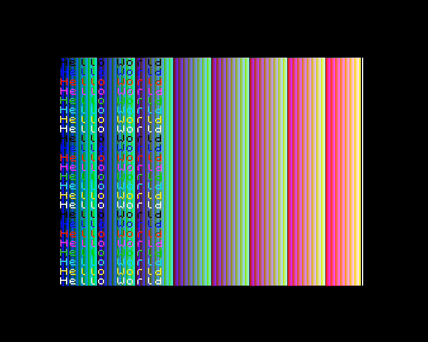

# Simple Layer 2



## Overview
This sample enables the Layer 2 display, fills it with all of the colours in the default palette and then draws text over this in the 8 Spectrum colours using the standard Spectrum font.

Layer 2 is a display mode with a 256x192 resolution that allows every pixel to be one of 256 colours.

When writes to Layer2 are enabled, the display presents itself as a linear array of 192 rows of 256 pixels beginning at address $0000. This is convenient as it means that in order to use a 16 bit register pair to address a pixel, if we put the y coordinate (0-191) into the high byte and the x coordinate (0-255) into the low byte, the address formed will be the address of the pixel. For example;

```
    ; writing the contents of register 'a' to pixel (x,y)
    ; where x = 70 and y = 68
    ld h,68 ; y coordinate
    ld l,70 ; x coordinate
    ld (hl),a
```
This makes it quite simple to work with (especially compared to the standard ZX Spectrum screen display whose layout is quite "fun" to deal with).

The downside though is the amount of memory taken to represent this display and the hoops you need to jump through to deal with it.

As the display is 256 x 192 with a byte per pixel it consumes 256 x 192 bytes, i.e. 49,152 bytes, i.e. 48K.

As every Next has at least 1MB of memory, finding somewhere to store this is not a problem, however accessing it is because of limitations of the Z80.

The Z80 can only "see" 64K of memory at a time, from address $0000 through to $ffff. The basic Next has a megabyte of memory (expandable to 2MB). A megabyte contains 1,048,576 bytes, so the Z80 clearly cannot access this directly and some sort of workaround is required, this workaround is known as "paging".

In order to gain access to the Next's expansive memory space, its memory is broken up into 8K "pages" and any one of these "pages" can be "mapped" into an 8K space in the Z80's address space.

You can't just map any old 8K block to any old address though, the 8K pages must start at addresses that are multiples of 8K, meaning the valid 8K pages in the Z80's address space are as follows;

* $0000 - 0K = page 0
* $2000 - 8K = page 1
* $4000 - 16K = page 2
* $6000 - 24K = page 3
* $8000 - 32K = page 4
* $A000 - 40K = page 5
* $C000 - 48K = page 6
* $e000 - 56K = page 7

As you can see there are 8 8K pages in the Z80's 64K address space and each of these can have any 8K page from the Next's RAM mapped into it.

The list of 8K pages in the Next's RAM address space start similar, but the list continues way beyond the 64K limit shown here.

For general memory access, this paging is controlled by the Memory Management Unit (MMU). This is a set of 8 registers, one for each page in the Z80's address space. Each register holds the page number of the 8K memory page in RAM that will be accessed by the Z80 when it reads or writes to the address range that particular register represents.

Fortunately, for Layer 2 access we can pretty much ignore most of this, but it's worth having a basic understanding of what's going on under the hood.

Which 48K of memory is used for the Layer2 display is set by Nextreg $12, this takes a 16K page number to tell the hardware which area of memory to display on screen when Layer2 is enabled.

To convert a 16K page number to an 8K page number, simply multiply it by 2.

By default (i.e. when the Next is first turned on) this is pointed to bank 8 (i.e. 8K bank 16) but NextZXOS moves it to bank 9 (i.e. 8K bank 18). In code we can move it to any 16K bank in the 1MB address space (the register only allows 6 bits, meaning addresses between $000000 and $0fffff).

For a simple example like this, we don't need to worry about this, but if we were doing something more complicated such as double buffering we would need to take this into account.

There are a number of ways to access the 48K memory space used by Layer2, but by far the simplest is to page it all into the Z80 address space between $0000 and $bfff (i.e. the first 48K of memory), but this comes with a number of caveats.

With Layer2 paged in for write access, all writes to the first 48K of the Z80's address space will be sent to the Layer 2 buffer. This means;
* code in the address range $0000-$ffff _can_ be executed.
* data in the address range $0000-$ffff _can_ be read.
* data in the address range $0000-$bfff _cannot_ be written to.
* data in the address range $c000-$ffff _can_ be written to.

As far as your own code is concerned, this mostly means that you cannot modify any variables you happen to have stored in the first 48K of memory while Layer 2 write access is enabled.

Beyond your own code, one of the main issues to be aware of concerns interrupt routines. By default, the Next executes the standard ZX Spectrum interrupt routine every 1/50th of second (when the hardware begins sending the display to the TV set). This routine expects to be able to access various system variables that are stored in the first 48K of memory.

The easiest way around to safely deal with this is to disable interrupts (with the "di" instruction) before you enable write access to Layer 2, do whatever drawing you need to, disable write access to Layer 2 and then re-enable interrupts (with the "ei" instruction).

Finally, you need to ensure that the stack is not in the first 48K of memory, otherwise _interesting_ things will happen when you use push or call instructions.

Things get even worse when you want to both read and write from Layer 2 memory because;
* code in the address range $0000-$bfff _cannot_ be executed.
* data in the address range $0000-$bfff _cannot_ be read or written to.
* code in the address range $c000-$ffff _can_ be executed.
* data in the address range $c000-$ffff _can_ be read or written to.

In this case, the safest and simplest option is to ensure that your code and data all reside in the upper 16K of the Z80's address space, i.e. between $c000 and $ffff, although this can be somewhat inconvenient.

In most instances, read access to Layer 2 can be avoided, you don't need it to draw into Layer 2, you really only need it if you want to interrogate the existing colour of a pixel, perhaps for collision detection.

It's worth mentioning that Layer 2 access can be set up to work in 16K blocks paged in to $0000 - $3fff, this leaves you with 48K of address space for code and data while working with a third of the screen buffer. The impracticality here is it's more difficult to work with the screen by dealing with it in thirds, the primary difficulty comes when drawing elements that span the boundary between adjacent thirds, although you could design your game around this.

As our code is going to use the full $0000-$bfff range of access to Layer2, the code is being assembled to address $c000 as set by the declaration of AppFirst in zeus.asm. The stack is also set to $ff40 by the declaration of Zeus_SP in zeus.asm. This saves us needing to worry about any of these issues with this simple example.

## Code Breakdown
The code for this example is contained entirely in the file simplelayer2.s, there are no additional assets.

It begins by declaring the registers used to access layer 2. For simplicity, we're going to leave quite a lot of these untouched. The defaults values of registers such as the clipping control and palette access are fine for the requirements of this example. In fact, the only Layer 2 register this example will use is $123b (LAYER2_ACCESS_PORT) as this controls the visibility and memory access to Layer 2.

Next we declare a set of macros to control Layer 2. Whenever these macros are used, they get replaced by the code declared within them in the final assembly. For small sets of instructions this generally will make a macro faster than calling a function, but at the cost of using more memory if the macro is large or used a lot. e.g. the following code;

```
    ld a,5 ; bank for layer 2
    HideLayer2()
    SetLayer2Bank(a)
```
would be equivalent to the following code;
```
    ld a,5 ; bank for layer 2
    ld bc,LAYER2_ACCESS_PORT
    ld a,LAYER2_ACCESS_DISABLE_NONE
    out (c),a
    nextreg LAYER2_RAM_BANK,a
```

This example illustrates a serious caveat with macros, you need to be aware what they do. In this example we've set a bank value in register 'a', but before using it, we've added the HideLayer2() macro, which internally modifies the 'a' register, meaning that by the time we've reached the SetLayer2Bank() macro, the bank value is wrong. So care needs to be taken about what registers are used in macro in much the same way it does when calling a function.

After declaring the macros we then disable interrupts. This is important as we're about to enable write access to Layer 2, which will cause problems if an interrupt happens to occur while we have things in this state.

One of the first things we do is set register $14 (GLOBAL_TRANS_COLOUR). By default, this is set to magenta (%111000011), which is one of the colours w're going to be drawing our text with. This would mean that our magenta text would be transparent, showing through the standard ULA screen hidden behind Layer 2. To avoid this happening, I've set the trans colour to 254, which is almost white. You should see, when you run the sample, that the next to last column of pixels on the display is black, this is colour 254 showing through the black ULA screen beneath it.

We then enable write access to Layer 2 as we want to draw into it, we also hide it so that the drawing actions cannot be seen. Typically you'd need to leave it visible and attempt to syncrhonise your updates with the hardware display update so it doesn't flicker, either by using "halt" instructions, setting up a line interrupt or simply waiting for the hardware display to reach a line that you're not trying to redraw. But for neatness and simplicity here we're just going to hide it while we draw into it.

With Layer 2 write enabled we can now draw into the current Layer 2 buffer. First, we're going to fill it with rows of every colour in the palette. The palette contains 256 colours and each row is 256 pixels wide, so we can just write increasing values from 0 to 255 across the row. As mentioned earlier, using a 16 bit register pair with the x coordinate in the low byte and the y coordinate in the high byte forms an address that points to the relevant pixel, making it really easy to work out which byte to modify for a particular screen coordinate.

Once we've filled the screen with colour we're going to draw some text. Following tradition, we're going to write the message "Hello World" repeatedly down the screen and because we're on the ZX Spectrum Next, we're going to draw this text in the basic colours of the original ZX Spectrum, i.e. black, blue, red, magenta, green, cyan, yellow and white.

We're also going to draw them using the standard Spectrum font, this requires you to have the standard Spectrum ROM loaded, which _should_ be the case. You'll know if it's not as although you'll be able to see the palette fill either the text will be garbled or it wont be there at all.

Once we've finished writing to Layer 2 display buffer, we can disable write access to Layer 2 and make it visible with the ShowLayer2() macro.

Finally, we enable interrupts again as it's now safe to do so and enter the main loop, which in this instance just sits there looping around.

The standard Spectrum text print routines don't work with Layer 2, so this example provides some that do. Although they use the standard Spectrum font, it's a one line change to make them use a user defined one (just change the initialisation of hl in PrintChar8x8 to point to the address your user defined font, subtract 256 if your font doesn't contain characters prior to space).

PrintChar8x8 draws a single ASCII character to the Layer 2 screen. Each character in the stock Spectrum font is represented by 8 bytes, each byte represents a row of pixels in the font, where bits are set, the drawing routine plots a pixel and where they aren't it doesn't.

PrintChar8x8 takes each byte of the font in turn and rotates it through the carry flag to detect if it should plot a point or not.

The significant thing about this function is it contains "unrolled loops". Consider the following;

Say we want to fill 8 bytes at address hl with the value in 'a'. We could write something like this;

```
    ld c,8
Lp:
    ld (hl),a
    inc hl
    dec c
    jr nz,Lp

We could also write something like this;

    ld (hl),a
    inc hl
    ld (hl),a
    inc hl
    ld (hl),a
    inc hl
    ld (hl),a
    inc hl
    ld (hl),a
    inc hl
    ld (hl),a
    inc hl
    ld (hl),a
    inc hl
    ld (hl),a
    inc hl

This is known as an unrolled loop. For every iteration of the loop we've just repeated the code. This means the code occupies more memory, but for every iteration we've saved having to execute the dec and jr instructions, this means that the unrolled loop will execute more quickly.

If you examine the code for PrintChar8x8 you'll not see anything similar to the above, this is because PrintChar8x8 plots up to 8 x 8 pixels, that's 64 pixels and manually unrolling that would be very laborious. Instead the example uses Zeus's "loop" and "lend" directives. This tells Zeus to repeat the code between "loop" and "lend" a given number of times (the value specified after "loop").

Looking at the code you'll see there are two "loop 8" directives. Each one of these unrolls the code that draws a row of pixels. The first one runs left to right, while the 2nd one runs right to left. At the end of drawing the first row, the pointer we're writing to will be at the right hand side of the character, so drawing the next row right to left saves us from having to move the pointer back to the start of the next row, this also leaves the pointer in the right place to begin drawing the next row from left to right.

This pair of unrolled loops are also inside a pair of "loop" / "lend" directives, telling the assembler to repeat the pair four times, giving us code to draw the entire eight rows of the character.

PrintText8x8 takes a string of characters and for each one calls PrintChar8x8 to draw it.